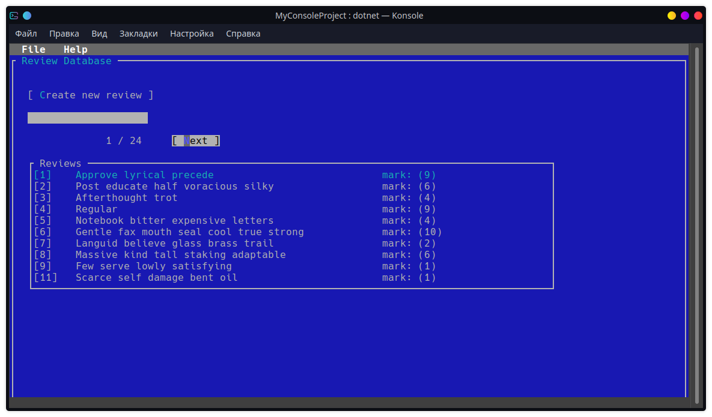
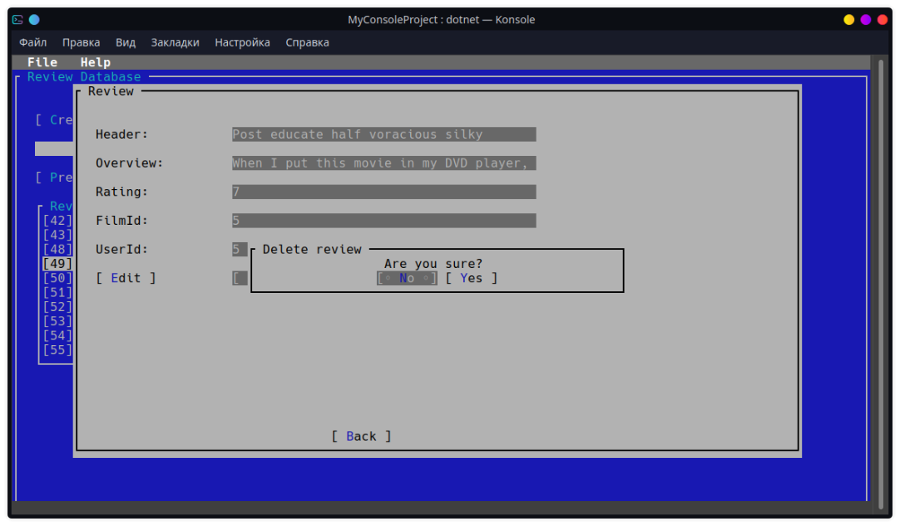
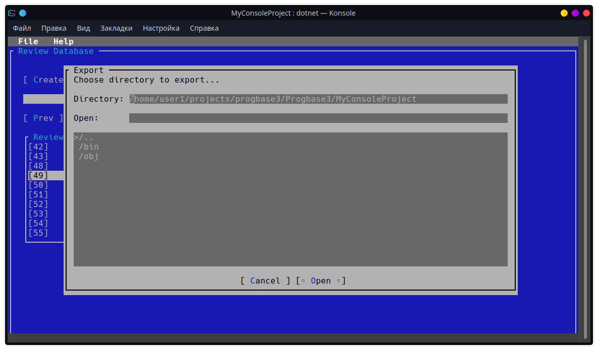
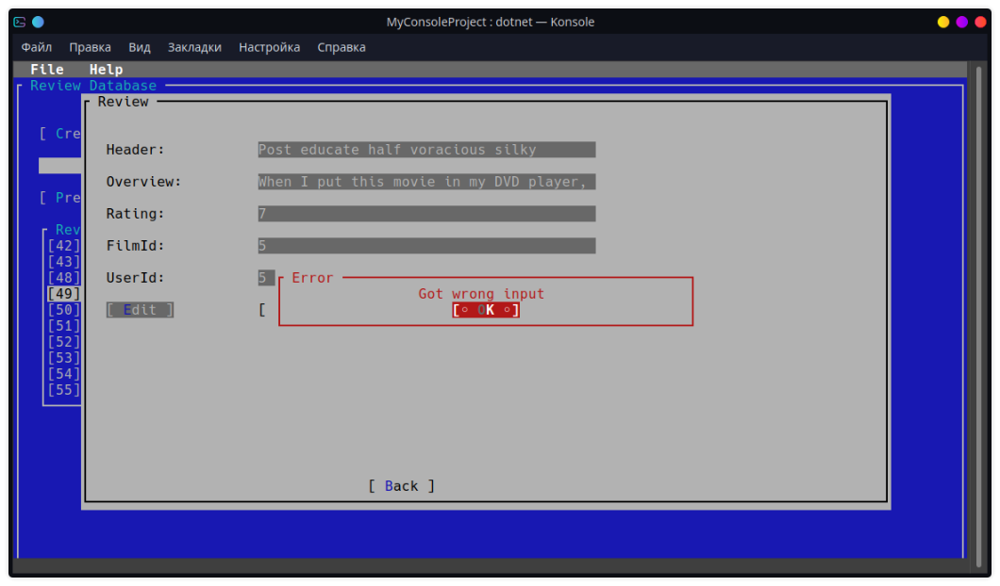

## Console GUI examples 

To display data, the system has a user interface that consists of:

1. Dialogue windows
2. Buttons
3. Frames
4. Menus

An example of a window with entity pagination:

An example of a request to confirm the user's action:

An example of a directory request window for export:

An example of displaying an error about entering invalid input data:

