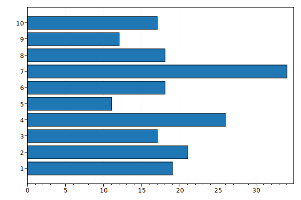

<!-- TABLE OF CONTENTS -->
<details>
  <summary>Table of Contents</summary>
  <ol>
    <li>
      <a href="#about-the-project">About The Project</a>
    </li>
    <li>
      <a href="#getting-started">Getting Started</a>
      <ul>
        <li><a href="#prerequisites">Prerequisites</a></li>
        <li><a href="#installation">Installation</a></li>
      </ul>
    </li>
    <li><a href="#usage">Usage</a></li>
    <li><a href="#contributing">Contributing</a></li>
  </ol>
</details>


<!-- ABOUT THE PROJECT -->
## About The Project

Movie Board is a system for managing an SQLite database of films and actors, which is intended to manage feedback and reviews of a certain film from real users.

It implements:
* Terminal GUI for managing the database
* Database dummy data generator
* Plot review stats generation
* XML serialization of data

<p align="right">(<a href="#readme-top">back to top</a>)</p>


<!-- GETTING STARTED -->
## Getting Started

To get a local copy up and running follow these simple steps.

### Prerequisites

To do all things you need to install Microsoft .NET Core 3.1.
* Installation guide: https://dotnet.microsoft.com/en-us/download/dotnet/3.1

### Installation

1. Clone the repo
   ```sh
   git clone git@github.com:gurug-prog/movie-board.git
   ```
2. Move to project directory
   ```sh
   cd movie-board
   ```
3. Build the solution `MovieBoard.sln`
   ```sh
   dotnet build MovieBoard.sln
   ```
4. Run the project!
   ```sh
   dotnet run --project MyConsoleProject\MyConsoleProject.csproj
   ```

<p align="right">(<a href="#readme-top">back to top</a>)</p>


<!-- USAGE EXAMPLES -->
## Usage

Before running the project you can fill the database with test values using built-in Entity Generator CLI.
You can choose 4 types of entities for generation, respectively: user, film, actor, review.

There is the syntax of the corresponding command line arguments:

1. To generate the User entity:
    ```sh
    dotnet run user {quantity} {dd.mm.yyyy–dd.mm.yyyy}
    ```

2. To generate the Actor entity:
    ```sh
    dotnet run actor {quantity} {age1-age2}
    ```

3. To generate the Film entity:
    ```sh
    dotnet run film {quantity} {year1-year2} {hh.mm.ss–hh.mm.ss}
    ```

4. To generate the Review entity:
    ```sh
    dotnet run review {quantity} {dd.mm.yyyy–dd.mm.yyyy}
    ```

The corresponding notations for the command line arguments are:

* `{quantity}` – a number of generated entities.
* `{age1-age2}` – an age generation interval from younger to older.
* `{year1-year2}` – a specified interval for generating calendar years from smaller to larger
* `{hh.mm.ss–hh.mm.ss}` - a specified interval for generating the duration of the movie, where 'hh' is hours, 'mm' is minutes, 'ss' is seconds.
* `{dd.mm.yy–dd.mm.yy}` - a specified interval for generating calendar dates, where 'dd' is a day, 'mm' is a month, and 'yy' is a year.

The example of review stats plot:



_Vertically - rating (from 1 to 10), horizontally - the number of reviews._

_The examples of displaying data in the application UI can be found [here](./Docs/Examples.md)_

<p align="right">(<a href="#readme-top">back to top</a>)</p>

<!-- CONTRIBUTING -->
## Contributing

Contributions are what make the open source community such an amazing place to learn, inspire, and create. Any contributions you make are **greatly appreciated**.

If you have a suggestion that would make this better, please fork the repo and create a pull request. You can also simply open an issue with the tag "enhancement".
Don't forget to give the project a star! Thanks again!

1. Fork the Project
2. Create your Feature Branch (`git checkout -b feature/AmazingFeature`)
3. Commit your Changes (`git commit -m 'Add some AmazingFeature'`)
4. Push to the Branch (`git push origin feature/AmazingFeature`)
5. Open a Pull Request

<p align="right">(<a href="#readme-top">back to top</a>)</p>
